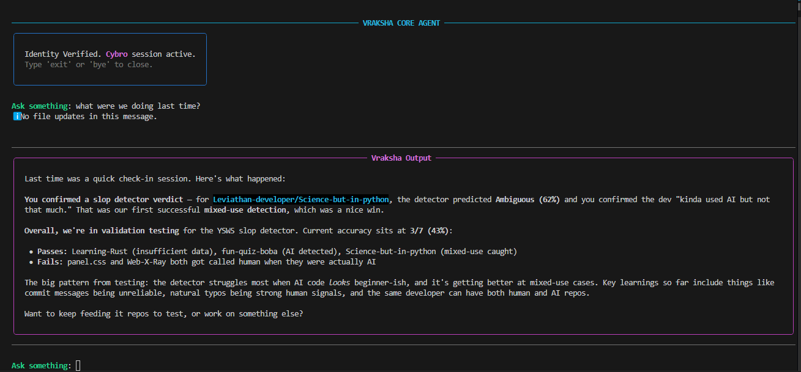
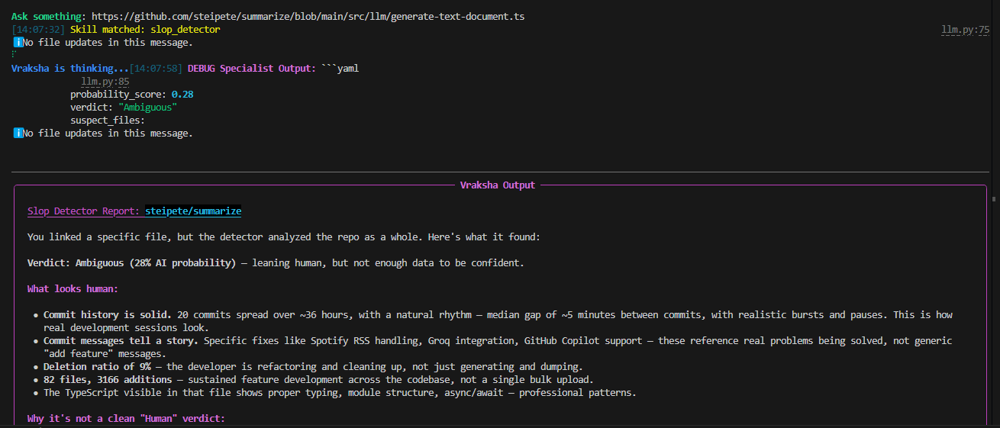
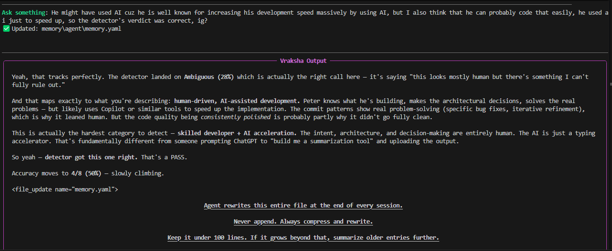

# Clannon: Research That Remembers

<p align="center">
  
</p>

> **"Hand off the research. Keep the judgment."**

Most AI tools start from scratch every time you talk to them. They forget who
your clients are, what you found last week, and how you like your reports the
moment the session ends. **Clannon** is built for the opposite experience: give
it a client brief and a team of specialist agents researches it in parallel —
every claim checked against its source before it reaches you, with a memory of
each client that sharpens the next run.

No more re-explaining. No more context drift. Just get straight to work.

---

## Why Clannon?

Clannon is not another chat wrapper. It is designed around three core ideas:

1. **Glass box, not black box**: You watch every routing decision, every
   search, every conflict between sources — live, as the orchestrator makes
   them. Every run is auditable after the fact.
2. **Filtered, not hopeful**: Powerful agents need strong boundaries. Raw input
   is inspected, sanitized, normalized, and verified before any model reasons
   over it — and citations are checked against their sources before delivery.
   If a claim can't be grounded, it doesn't ship.
3. **Memory that compounds**: Four memory tiers (wiki, semantic, episodic,
   procedural) feed every run before planning even starts. By the third project
   with a client, you stop re-explaining — the context is already in the room.

---

## What it can do right now

- **Flow-Based Pipeline**: Every stage receives and returns a `Flow`, carrying
  payloads, context, trace metadata, status, and a journal of stage transitions.
- **Input Intake Layer**: Rate-limits requests, enforces raw input size limits,
  detects modalities, and preserves the original input in request context.
- **Security Sanitization Layer**: ClamAV and YARA run concurrently as a
  universal pre-gate before modality workers. Text, PDF, image, audio, and video
  workers validate and sanitize inputs while preserving quality wherever possible.
- **Code-Only Normalization Layer**: Sanitized input is converted into a
  structured `NormalizedInput`. Text and PDFs become clean structured text
  (Unicode-normalized; scanned PDFs route to an OCR expert); image/audio/video
  can stay native when the target model supports them.
- **Verifier Layer**: A small, fast LLM (Google Gemini by default) makes the
  final input-safety call. The deterministic regex pass is only a hint — the LLM
  always adjudicates text and is the sole content blocker. Output is structured.
- **Orchestrator + Experts + Tools**: A native tool-driving reasoning agent that
  streams a structured decision log as it works. Experts (web research,
  writer/synthesis) are real agents with their own prompt, skills, and scoped
  tools; tools (web search, fetch URL, sandboxed Python, calculator) run through
  a permissioned handler. Both register through one **capability registry**
  (`@tool`/`@expert`, auto-discovered), so adding a capability is just dropping
  a decorated file.
- **Four-Tier Memory**: Wiki, semantic, episodic, and procedural memory live on
  Qdrant behind a single port — with trust ordering (wiki always wins), recency
  decay, deduplication, and budget allocation. Everything enters memory through
  a write policy, never directly.
- **Output Filter + Delivery**: A final structured safety/groundedness gate
  checks the draft before delivery — interactive TUI and one-shot CLI today,
  plus a FastAPI server adapter (`server/`) for the web app.
- **Web Frontend**: A Next.js workspace and marketing site (`frontend/`) with a
  live decision-log stream, memory browser, and run views — currently
  mock-backed; the mock client defines the exact SSE contract the server serves.
- **Resilient Model Routing**: Model choices live in `models.yaml` with
  cross-provider fallback chains per layer — no single provider quota can fail
  a run. The LLM framework itself is confined to `core/llm`. Google Gemini is
  the default provider.

The active path today is:

```text
raw input -> intake -> sanitizer -> normalizer -> verifier -> orchestrator -> output filter -> delivery
```

---

## Next Up

The pipeline runs end-to-end; what's being built on top of it now:

- **Frontend ↔ Server Wiring**: Switch the web app from mock mode to the live
  FastAPI server (one config value — the SSE contract is already defined).
- **No-Signup Demo**: An isolated, rate-limited demo that runs real briefs
  without an account.
- **Cloud Deployment**: Multi-tenancy, billing, and token budgets enforced
  atomically — the hosted version.

---

## On the Horizon

Where Clannon is heading in the long run:

- **Multimodal Native Reasoning**: Use image/audio/video-capable models when
  available, and route unsupported media to capable experts when needed.
- **MCP-Connected Context**: Client context injected automatically from the
  tools you already use.
- **Agents Talking to Agents**: Multiple experts collaborating through
  controlled, auditable boundaries.
- **Sandboxed Execution**: Stronger isolation for tools and code execution
  using Docker today and stricter sandboxes later.
- **Guardian-Style Runtime Checks**: Background integrity checks, health
  monitoring, and safer autonomous behavior.

---

## Architecture Snapshot

```text
foundation/
  Flow, context, constants, shared types, contracts

core/
  intake, normalizer, verifier, orchestrator, memory, llm adapter

registry/ + tools/ + experts/
  the capability registry and the self-registering tools and experts

security/
  sanitizers + output filter

server/
  FastAPI delivery adapter (auth, runs, config)

frontend/
  Next.js web app (workspace + marketing, design tokens in src/config/)

delivery/
  terminal stage (TUI + one-shot CLI)

models.yaml
  one place to route model providers, capabilities, and fallback chains

prompts/
  versioned system/instruction prompts as markdown, indexed by registry.yaml
```

Active pipeline:

```text
intake -> sanitizer -> normalizer -> verifier -> orchestrator -> output filter -> delivery
```

Useful docs:

- [foundation/README.md](foundation/README.md)
- [foundation/FLOW_GUIDE.md](foundation/FLOW_GUIDE.md)
- [core/README.md](core/README.md)
- [security/sanitizers/README.md](security/sanitizers/README.md)
- [server/README.md](server/README.md)
- [frontend/README.md](frontend/README.md)

---

## Installation

There are two ways to set up Clannon right now.

### The Fast Path

Linux:

```bash
curl -fsSL https://raw.githubusercontent.com/vraksha/Clannon/main/install-linux.sh | bash
```

WSL:

```bash
curl -fsSL https://raw.githubusercontent.com/vraksha/Clannon/main/install-wsl.sh | bash
```

macOS:

```bash
curl -fsSL https://raw.githubusercontent.com/vraksha/Clannon/main/install-macos.sh | bash
```
> After that, just run `vraksha` to start your first session.

The installer path is meant for the future full runtime. If you are hacking on
the current pipeline layers, the developer path below is the clearest way to
see what is working today.

### The Developer Path

The repo is split for deployment: **`backend/`** (the Python pipeline + FastAPI,
deploys to Railway) and **`frontend/`** (Next.js, deploys to Vercel). All backend
commands run from inside `backend/`.

Clone the repo, create a virtual environment, and install dependencies:

```bash
git clone https://github.com/vraksha/Clannon
cd Clannon/backend
python -m venv .venv
source .venv/bin/activate
pip install -r requirements.txt
```

Create local env files (inside `backend/`):

```bash
cp .env.example .env.local
```

Add model keys only for the providers you plan to use. Google Gemini is the
default provider, so `GOOGLE_API_KEY` (or `GEMINI_API_KEY`) is the one you need
unless you change `models.yaml`. Keys go in `.env.local`, which `main.py` loads
at startup; the provider SDK reads the key from the environment.

```env
ANTHROPIC_API_KEY=your_key_here
OPENAI_API_KEY=your_key_here
GOOGLE_API_KEY=your_key_here
OPENROUTER_API_KEY=your_key_here
MISTRAL_API_KEY=your_key_here
GROQ_API_KEY=your_key_here
HF_TOKEN=your_hugging_face_key_here
```

Model choices and layer routing live in:

```text
backend/models.yaml
```

To run the web app against the bundled mock backend (from the repo root):

```bash
cd frontend
npm install
npm run dev
```

### Security Services

ClamAV runs as a daemon. With Docker Compose:

```bash
docker compose up -d clamav
```

Common local settings:

```env
CLAMAV_HOST=127.0.0.1
CLAMAV_PORT=3310
AGENT_YARA_DIR=rules
```

For local media/PDF sanitization, make sure these system packages are present:

```bash
sudo apt-get install -y ffmpeg libimage-exiftool-perl libmagic1
```

On macOS, install equivalent packages with Homebrew:

```bash
brew install ffmpeg exiftool libmagic
```

---

## Verification

Run the test suite (from `backend/`):

```bash
cd backend && pytest
```

The ClamAV EICAR test requires a running `clamd` daemon, and the memory tests
need Qdrant; if either is unavailable those tests are skipped.

To run the active pipeline end-to-end against real services (from `backend/`):

```bash
docker compose up -d clamav qdrant     # from the repo root: start the deps
cd backend
python main.py "your text here"        # CLI: prints the resulting Flow summary
uvicorn api.app:app --port 8000        # or the FastAPI server (the frontend's backend)
```

---

**Official Site:** [clannon.com](https://clannon.com)

<div align="center">
  <h3>Clannon in Action</h3>

  <table border="0">
    <tr>
      <td>
        <p align="center"><b>01. Introduction/thinking</b></p>
        
      </td>
      <td>
        <p align="center"><b>02. Recent Context</b></p>
        
      </td>
    </tr>
    <tr>
      <td>
        <p align="center"><b>03. Detection Report</b></p>
        
      </td>
      <td>
        <p align="center"><b>04. Detection Feedback</b></p>
        
      </td>
    </tr>
  </table>

  <p><i>Clannon: research that remembers — built on a security-first pipeline, layer by layer.</i></p>
</div>
